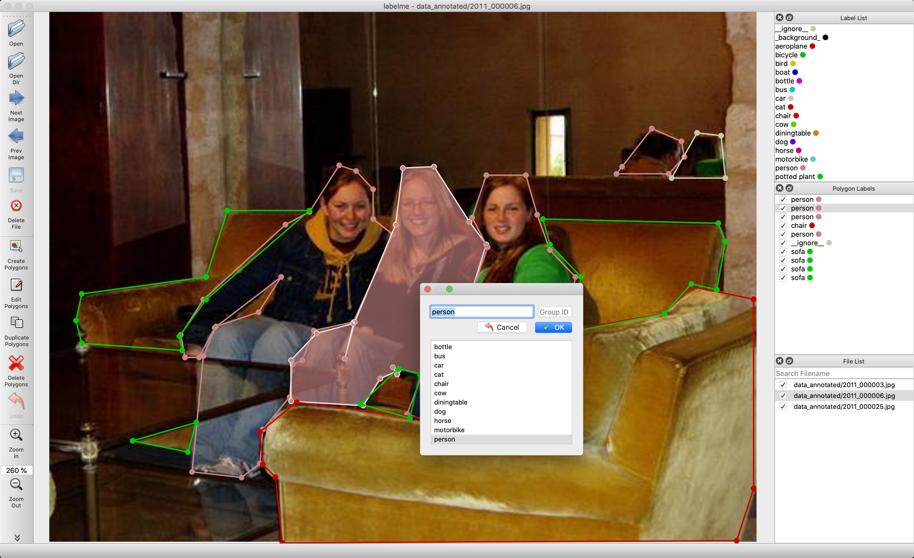

<h1 align="center">
  <br/>mindAT
</h1>

<h4 align="center">
  Image Polygonal Annotation with Python
</h4>

<div align="center">
  <a href="https://pypi.python.org/pypi/mindAT"></a>
  <a href="https://pypi.org/project/mindAT"></a>
  <a href="https://github.com/codebaragi23/mindAT/actions"></a>
  <a href="https://hub.docker.com/r/codebaragi23/mindAT"></a>
</div>

<div align="center">
  <a href="#installation"><b>Installation</b></a> |
  <a href="#usage"><b>Usage</b></a> |
  <a href="https://github.com/codebaragi23/mindAT/tree/master/examples/tutorial#tutorial-single-image-example"><b>Tutorial</b></a> |
  <a href="https://github.com/codebaragi23/mindAT/tree/master/examples"><b>Examples</b></a> |
  <a href="https://www.youtube.com/playlist?list=PLI6LvFw0iflh3o33YYnVIfOpaO0hc5Dzw"><b>Youtube FAQ</b></a>
</div>

<br/>

<div align="center">
  
</div>

## Description

Labelme is a graphical image annotation tool inspired by <http://mindAT.csail.mit.edu>.  
It is written in Python and uses Qt for its graphical interface.

      
<i>VOC dataset example of instance segmentation.</i>

    
<i>Other examples (semantic segmentation, bbox detection, and classification).</i>

    
<i>Various primitives (polygon, rectangle, circle, line, and point).</i>


## Features

- [x] Image annotation for polygon, rectangle, circle, line and point. ([tutorial](examples/tutorial))
- [x] Image flag annotation for classification and cleaning. ([#166](https://github.com/codebaragi23/mindAT/pull/166))
- [x] Video annotation. ([video annotation](examples/video_annotation))
- [x] GUI customization (predefined labels / flags, auto-saving, label validation, etc). ([#144](https://github.com/codebaragi23/mindAT/pull/144))
- [x] Exporting VOC-format dataset for semantic/instance segmentation. ([semantic segmentation](examples/semantic_segmentation), [instance segmentation](examples/instance_segmentation))
- [x] Exporting COCO-format dataset for instance segmentation. ([instance segmentation](examples/instance_segmentation))


## Requirements

- Ubuntu / macOS / Windows
- Python2 / Python3
- [PyQt4 / PyQt5](http://www.riverbankcomputing.co.uk/software/pyqt/intro) / [PySide2](https://wiki.qt.io/PySide2_GettingStarted)


## Installation

There are options:

- Platform agonistic installation: [Anaconda](#anaconda), [Docker](#docker)
- Platform specific installation: [Ubuntu](#ubuntu), [macOS](#macos), [Windows](#windows)
- Pre-build binaries from [the release section](https://github.com/codebaragi23/mindAT/releases)


### Docker

### Build

```bash
/mindAT$ docker build -t codebaragi23/mindAT -f docker/Dockerfile .
```

#### Run application
You need install [docker](https://www.docker.com), then run below:

```bash
# on macOS
socat TCP-LISTEN:6000,reuseaddr,fork UNIX-CLIENT:\"$DISPLAY\" &
docker run -it -v /tmp/.X11-unix:/tmp/.X11-unix -e DISPLAY=docker.for.mac.host.internal:0 -v $(pwd):/root/workdir codebaragi23/mindAT

# on Linux
xhost +
docker run -it -v /tmp/.X11-unix:/tmp/.X11-unix -e DISPLAY=:0 -v $(pwd):/root/workdir codebaragi23/mindAT
```

#### Run bin/bash

```bash
# on macOS
socat TCP-LISTEN:6000,reuseaddr,fork UNIX-CLIENT:\"$DISPLAY\" &
docker run -it -v /tmp/.X11-unix:/tmp/.X11-unix -e DISPLAY=docker.for.mac.host.internal:0 -v $(pwd):/root/workdir --entrypoint="/bin/bash"  codebaragi23/mindAT

# on Linux
xhost +
docker run -it -v /tmp/.X11-unix:/tmp/.X11-unix -e DISPLAY=:0 -v $(pwd):/root/workdir --entrypoint="/bin/bash" codebaragi23/mindAT
```

## How to build standalone executable

Below shows how to build the standalone executable on macOS, Linux and Windows.  

```bash
# Setup conda
conda create --name mindAT python==3.6.0
conda activate mindAT

# Build the standalone executable
pip install .
pip install pyinstaller
pyinstaller mindAT.spec
dist/mindAT --version
```
